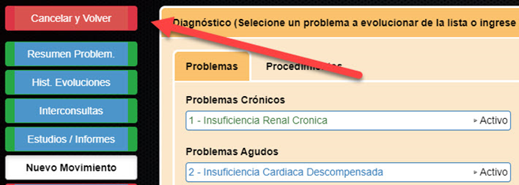

# 8. Preguntas frecuentes

### Tengo problemas de visualización de la Historia Clínica Electrónica

Usar únicamente el navegador Chrome para trabajar con la HCE. El uso de un navegador diferente, puede traer problemas de visualización e impresión.

### ¿Dónde puedo encontrar la Historia Clínica de un paciente que di de alta?

Si el profesional tuvo intervención en la atención del paciente fue evolucionado al menos una vez. Podra encontrar un acceso a la HCE del paciente en la siguiente ruta: Internadosà En Seguimiento à”Ver Históricos”

.png>)

Luego de hacer clic en “Ver Históricos”

Se mostrará una lista con todos los pacientes atendidos en el área de internación.

### ¿Puedo acceder a las interconsultas de un servicio diferente al predeterminado?

Si. Supongamos que hay un médico inmunólogo que tiene un cargo en el servicio de “Guardia general” y tiene una prestación en el servicio de “Inmunología”.

Este médico tendrá como predeterminado el servicio de “Guardia general”.

.png>)

Sin embargo este profesional podrá acceder a las interconsultas de inmunología escribiendo en el casillero donde figura el nombre del servicio al que quiera acceder en este caso Inmuno.

Sin embargo este profesional podrá acceder a las interconsultas de inmunología escribiendo en el casillero donde figura el nombre del servicio al que quiera acceder en este caso Inmuno.

### El servicio que me figura como predeterminado, no es en que estoy actualmente

En el caso de que el servicio que figura como predeterminado no coincida con el servicio al cual el profesional pertenece. Podrá solicitar la actualización en el área de personal.

### ¿Puede más de un especialista realizar seguimiento a un paciente?

Si. Solo debe asignarse la interconsulta desde el buzón general.

### No se cargó el problema que necesito a la lista de problemas

Si el problema fue adecuadamente seleccionado, clasificado y al hacer clic en agregar no es agregado a la lista de problemas a pesar de presionar 2 veces agregar. _**No**_ continuar intentando. Se debe hacer clic en “cancelar y volver” e intentar cargar el problema nuevamente.

En caso de persistir el problema comunicarse con informática.

Para evitar aparición de errores en la lista de problemas se debe evitar cargar de una lista muy extensa de problemas en un único movimiento.

### ¿Puedo eliminar un problema luego de haberlo agregado?

Si. Pero solo si no se ha realizado una evolución luego de agregar el problema.

Ejemplo: Acabas de agregar el Problema “Hipertensión Arterial” a tu lista de problemas, pero por error lo ingresaste como un Problema AGUDO, cuando se trata de un problema CRONICO. En este caso aún no has evolucionado, así que podés hacer clic con el botón izq del mouse sobre el problema que acabas de agregar y en el menú emergente seleccionar ELIMINAR.

.png>)

### No figura la fecha de alta y días de internación en la epicrisis

Estos datos son grabados en la epicrisis una vez la epicrisis es finalizada y que el paciente es dado de alta en el área de admisión del Hospital.

### ¿Mis borradores pueden ser vistos por otro usuario?

No. Los borrados son de uso personal. Persisten hasta que son finalizados y consolidados o eliminados.

Ver más acerca de los borradores: Trabajando con borradores

### ¿Con que fecha se guardan los borradores?

Los borrados se consolidan en la base de datos con la fecha y hora del momento en que es finalizado. La fecha de creación del borrador no tiene relevancia.

### Mensaje: OTP incorrecto

La mayoría de las veces este error se debe a la falta de coincidencia entre la hora de la PC y la del Smartphone.

Probar ajustando la hora del Smartphone.

En caso de persistir el problema, acercarse a la oficina de firma digital.

### ¿Con que frecuencia debo firmar los documentos de la HCE?

Los documentos generados deberán ser firmados diariamente. En caso de no haber podido firmar por problemas técnicos el mismo día, los documentos deberán ser firmados el día siguiente.

### No puedo ver el informe de un estudio ya realizado

Los informes de los estudios podrán ser visualizados en este apartado una vez que hayan sido firmados por el profesional que realizado el estudio. Por más que el estudio haya sido cargado al sistema no se mostrara hasta que haya sido firmado.

> **Esta guía será actualizando según se vayan incorporando funcionalidades en el sistema. Actualizada por última vez en abril de 2021**
>
> **Ariel Carvajal**

****
